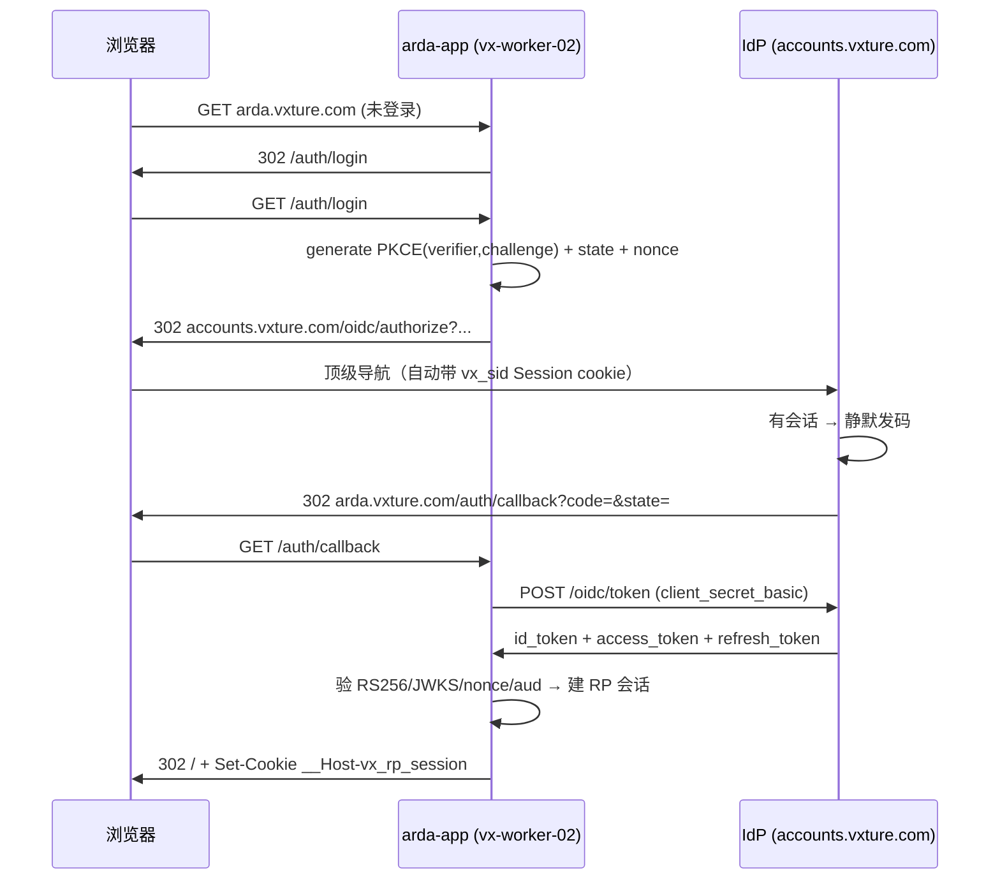

# Arda OIDC SSO 集成方案（C1 操作细则）

> 版本：v2.0（2026-07-06 修订）| 状态：已定稿，待实施（生产动作逐步授权）
> 上位规划：[`docs/design/product_310_arda-integration.md`](../docs/design/product_310_arda-integration.md)（Arda 对接实施总纲，本文 = 其 P1 阶段 C1 通道的操作细则）
> **v2.0 修订说明**：v1.1 的 Q1 决策（"arda 保持 platform shell 定位、无订阅门控"）随 [`product_100_matrix.md`](../docs/design/product_100_matrix.md) v1.0 定稿**作废**——Arda 为 **L2 数据平台产品**（订阅=是，"arda=平台门户 shell"旧表述作废）。同时本文对齐 seed 现实：`arda` / `arda-beta` client 已在 seed 登记（v1.1 所列 §2.1/§2.3 大部分已完成）。

## 🔑 已决策事项

| #   | 问题                | 决策                                                                                                                                                                                                                           |
| --- | ------------------- | ------------------------------------------------------------------------------------------------------------------------------------------------------------------------------------------------------------------------------ |
| Q1  | 是否需要订阅计划？  | ✅ **需要**（v2.0 反转）。Arda = L2 数据平台产品，参与 workspace × product 权益引擎（ADR-11）；**门控不经 token，经 C2 实时回查**（`product_200_integration.md` §3）。plan 结构（`arda-free` 起步）随 product_310 P1.2 落 seed |
| Q2  | arda-app 代码位置？ | **独立仓库**（不在 vxture monorepo 内）。需参考 [`docs/design/identity-platform-rp-integration.md`](../docs/design/identity-platform-rp-integration.md) 自行实现 RP 端点                                                       |
| Q3  | client_id 策略？    | **双 client**（v2.0 按 seed 现实更新）：`arda`（stable）+ `arda-beta`（release_channel=beta，仅当 `ARDA_BETA_BASE_URL` 注入时登记），各自单条 redirect_uri；v1.1 的"单 client 双 URI"表述作废                                  |

---

## 1. 现状拓扑

```
VXTURE_DEPLOY_HOST (edge, TLS)
  └─ nginx arda.vxture.com (✅ 已修复端口 3230/3231)
      ├── /_next/static/   → 100.76.219.48:3230
      ├── /auth/*          → 100.76.219.48:3230  ✅ Mode A 同源
      ├── /api/*           → 100.76.219.48:3230  ✅
      └── /                → 100.76.219.48:3230

beta-arda.vxture.com → 100.76.219.48:3231
```

## 2. 平台侧变更（本仓库 vxture monorepo）

### 2.1 注册 arda OIDC Client（seed 扩展）——✅ 已完成（seed 已登记）

`deploy/database/seed/seed-catalog.mjs` 现状（v2.0 核实）：

| client_id   | realm      | release_channel | redirect_uris                                   | back_channel_logout_uri（自动推导）             | allowed_scopes                                 |
| ----------- | ---------- | --------------- | ----------------------------------------------- | ----------------------------------------------- | ---------------------------------------------- |
| `arda`      | `customer` | `stable`        | `${ARDA_BASE_URL}/auth/callback`                | `${ARDA_BASE_URL}/auth/backchannel-logout`      | `openid profile email phone arda:subscription` |
| `arda-beta` | `customer` | `beta`          | `${ARDA_BETA_BASE_URL}/auth/callback`（条件行） | `${ARDA_BETA_BASE_URL}/auth/backchannel-logout` | 同上                                           |

> ⚠️ 对齐登记（随 product_310 P2.1 裁定）：`product_200` §3 铁律 = **entitlement 永不入 token**（C2 实时回查）。`arda:subscription` scope 沿用了旧产品行模式（ruyin 先例经 scope 折 claim）；C2 端点落地后该 scope 的去留/语义收敛为独立裁定项，本文不擅动 seed。

### 2.2 更新 23-seed-platform-database.sh 环境投影——✅ 已完成

`deploy/scripts/23-seed-platform-database.sh`（及 `29-seed-platform-ddl.sh`）已投影：`OIDC_CLIENT_SECRET_HASH_ARDA` / `OIDC_CLIENT_SECRET_HASH_ARDA_BETA` / `ARDA_BASE_URL` / `ARDA_BETA_BASE_URL`。

### 2.3 确认 27-provision-client-secrets.sh

✅ **已完成**：`arda` 已在 `REMOTE_CLIENTS_ALL="ruyin arda"` 中。

**操作**：通过 `CONFIRM_PROVISION_SECRETS=yes` 执行该脚本 → 生成 `OIDC_CLIENT_SECRET_HASH_ARDA` 写入 `.env.auth-bff`，`oidc-client-secret-arda.txt` 写入 `secrets/`。

### 2.4 传输 OIDC Client Secret 到 vx-worker-02

```
cat /srv/vxture/runtime/secrets/oidc-client-secret-arda.txt
```

将输出的 plaintext secret 设置到 vx-worker-02 arda-app 的环境变量 `OIDC_CLIENT_SECRET`。

---

## 3. Arda-app 侧变更（独立仓库）

### 3.1 需实现的 RP 端点

参考 [`identity-platform-rp-integration.md §4`](../docs/design/identity-platform-rp-integration.md#4-app-须实现的端点app-bff)：

| 端点                            | 职责                                         | 参考实现                                                                             |
| ------------------------------- | -------------------------------------------- | ------------------------------------------------------------------------------------ |
| `GET /auth/login`               | PKCE + state + nonce → 302 到 IdP authorize  | [`oidc-auth.router.ts#L72`](../bff/website-bff/src/routers/oidc-auth.router.ts:72)   |
| `GET /auth/callback`            | 换码 → 验 id_token → 建 RP 会话 → set cookie | [`oidc-auth.router.ts#L96`](../bff/website-bff/src/routers/oidc-auth.router.ts:96)   |
| `GET /auth/session`             | 读 cookie → 验 access_token → 返回 claims    | [`oidc-auth.router.ts#L149`](../bff/website-bff/src/routers/oidc-auth.router.ts:149) |
| `POST /auth/logout`             | 销毁 RP 会话 → 302 IdP end_session           | [`oidc-auth.router.ts#L202`](../bff/website-bff/src/routers/oidc-auth.router.ts:202) |
| `POST /auth/backchannel-logout` | 验 logout_token → destroyBySid               | 需新增                                                                               |

### 3.2 必需环境变量

| 变量                            | 值                                                                                           |
| ------------------------------- | -------------------------------------------------------------------------------------------- |
| `OIDC_ISSUER`                   | `https://accounts.vxture.com`                                                                |
| `OIDC_CLIENT_ID`                | `arda`                                                                                       |
| `OIDC_CLIENT_SECRET`            | 从 VXTURE_DEPLOY_HOST secrets/ 传输而来                                                      |
| `OIDC_REDIRECT_URI`             | `https://arda.vxture.com/auth/callback`                                                      |
| `OIDC_SCOPES`                   | `openid profile email phone`（`arda:subscription` 去留见 §2.1 对齐登记）                     |
| `OIDC_POST_LOGOUT_REDIRECT_URI` | `https://arda.vxture.com/`                                                                   |
| `RP_SESSION_TTL`                | 建议对齐平台 customer 会话纪律（FB-006：绝对 TTL 1d），v1.1 的 30 天值作废，终值归 arda 仓定 |
| `REDIS_URL`                     | 需 Redis 实例用于 RP 会话存储                                                                |

### 3.3 Beta 环境

Beta-arda 使用**同一 `client_id`**，但配置：

- `OIDC_REDIRECT_URI` = `https://beta-arda.vxture.com/auth/callback`
- `OIDC_POST_LOGOUT_REDIRECT_URI` = `https://beta-arda.vxture.com/`

---

## 4. 认证流程



---

## 5. 实施路线图

### Phase 1 — 平台侧（本仓库，CI/CD 部署）

| Step | 文件/操作                                                     | 说明                                                                                                      | 状态                                                |
| ---- | ------------------------------------------------------------- | --------------------------------------------------------------------------------------------------------- | --------------------------------------------------- |
| 1    | 注册 arda oidc_client 到 seed-catalog.mjs                     | `arda` + `arda-beta` client 记录                                                                          | ✅ 已在 seed                                        |
| 2    | 更新 23-seed-platform-database.sh 环境投影                    | `ARDA(_BETA)_BASE_URL`、`OIDC_CLIENT_SECRET_HASH_ARDA(_BETA)`                                             | ✅ 已投影                                           |
| 2.5  | 产品目录联动（product_310 P1.1/P1.2）                         | seed `data`→`arda` 改码（M1）+ `nocus` 退役（M2）+ `arda-free` plan 结构                                  | ✅ PR #663（2026-07-07 落活库）                     |
| 3    | 生产环境执行 27-provision-client-secrets.sh                   | 生成 secret + hash（`REMOTE_CLIENTS_ALL` 含 arda + arda-beta，双 client）                                 | ✅ 已就位（hash 在 .env.auth-bff，明文在 secrets/） |
| 4    | 传输 OIDC_CLIENT_SECRET 到 arda 宿主                          | 手动操作：worker-01 `/srv/vxture/runtime/secrets/oidc-client-secret-arda{,-beta}.txt`（0600），转运后删除 | ⬜ **待 owner**（线 B 建仓后）                      |
| 5    | 生产环境重新 seed（**29-seed-platform-ddl.sh**，23 已被取代） | 使 oidc_client + 目录改码生效                                                                             | ✅ 2026-07-07 实跑，DB 目标态验证通过               |
| 6    | CI/CD: PR → develop → beta → main → deploy                    | 完整流水线（#664 beta / #665 main 晋升 + deploy-production）                                              | ✅ 2026-07-07                                       |

### Phase 2 — Arda-app 侧（独立仓库）

| Step | 操作                            | 说明                            |
| ---- | ------------------------------- | ------------------------------- |
| 1    | 实现 `/auth/login`              | PKCE + IdP redirect             |
| 2    | 实现 `/auth/callback`           | Token exchange + session        |
| 3    | 实现 `/auth/session`            | Session lookup                  |
| 4    | 实现 `/auth/logout`             | Local destroy + IdP end_session |
| 5    | 实现 `/auth/backchannel-logout` | Logout token verification       |
| 6    | 配置环境变量                    | OIDC_ISSUER/CLIENT_ID/SECRET 等 |
| 7    | 端到端验证                      | SSO/Callback/Refresh/Logout     |

---

## 6. 影响范围

| 范围                                          | 影响                                        | 风险            |
| --------------------------------------------- | ------------------------------------------- | --------------- |
| `deploy/scripts/23-seed-platform-database.sh` | 加 2 行环境变量投影                         | 低              |
| `deploy/database/seed/seed-catalog.mjs`       | client 已登记；剩产品目录改码（M1/M2/plan） | 低（幂等 seed） |
| `.env.auth-bff`（生产）                       | 加 2 行配置                                 | 低              |
| `secrets/oidc-client-secret-arda.txt`（生产） | 新文件，需手动传输                          | 中（密钥管理）  |
| vx-worker-02 arda-app                         | 完整 RP 实现                                | 中（独立仓库）  |
| IdP auth-bff                                  | **零改动**                                  | ✅ 无风险       |
| nginx 配置                                    | **零改动**                                  | ✅ 已就绪       |

---

## 7. 验收清单

- [ ] 用户已登录 vxture（有 `vx_sid`）→ 访问 `arda.vxture.com` **免再登录**
- [ ] 未登录用户访问 arda → 重定向到 `accounts.vxture.com` 登录页
- [ ] 篡改 token → 被拒（RS256/iss/aud/exp/nonce 全部校验）
- [ ] 浏览器**零 OIDC token**，仅 `__Host-vx_rp_session`
- [ ] Refresh token 轮换：旧 refresh 重放被拒
- [ ] 全局登出（任一 vxture app）→ arda 经 back-channel 会话被杀
- [ ] Beta 环境：`beta-arda.vxture.com` 同样验证通过
